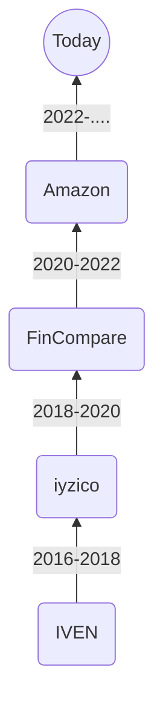

### Hi there 👋

- 🔭 I’m currently working on _distributed systems in production_.
- 🌱 I’m currently learning _stocks & trading_.
- 👯 I’m looking to collaborate on _open-source IoT projects_.
- 🤔 I’m looking for help with _wide-area-mesh-networks_.
- 💬 Ask me about _DevOps/infrastructure and computer networks_.
- 📫 How to reach me: _mert@akeng.in_
- 😄 Pronouns: _He/Him_
- ⚡ Fun fact: _Aviation enthusiast_.

## History

